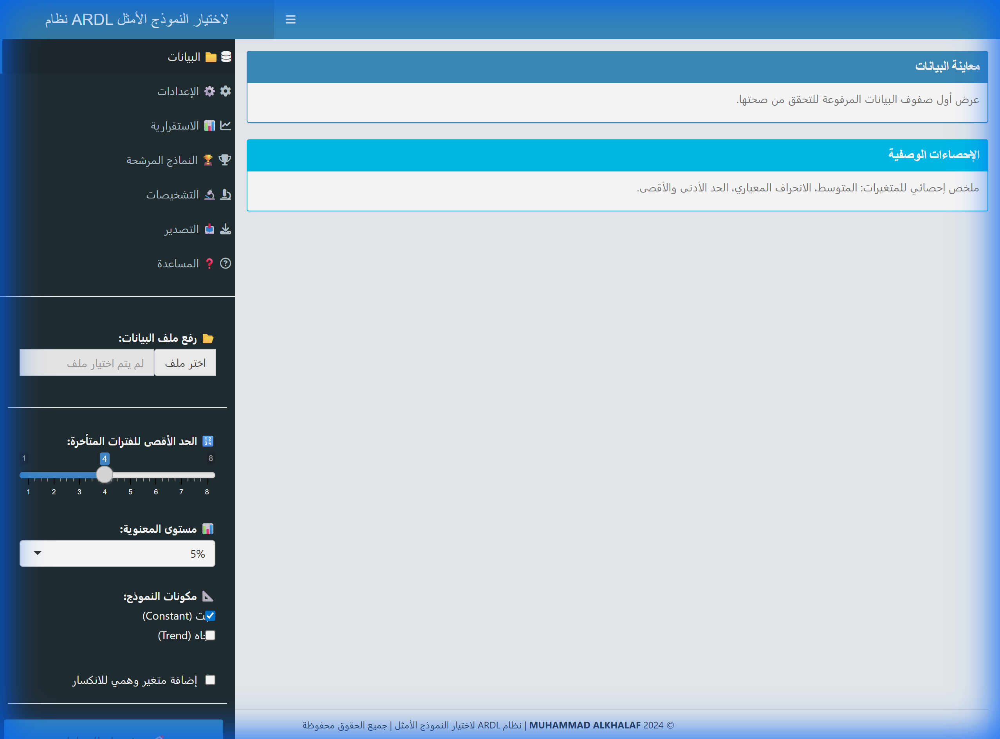
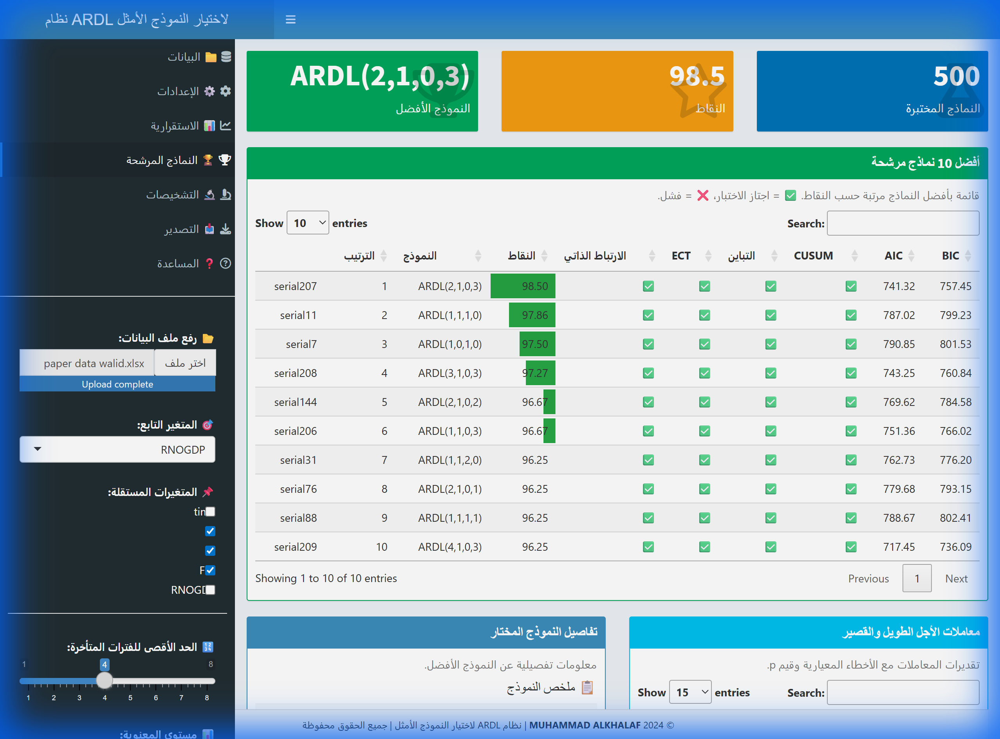
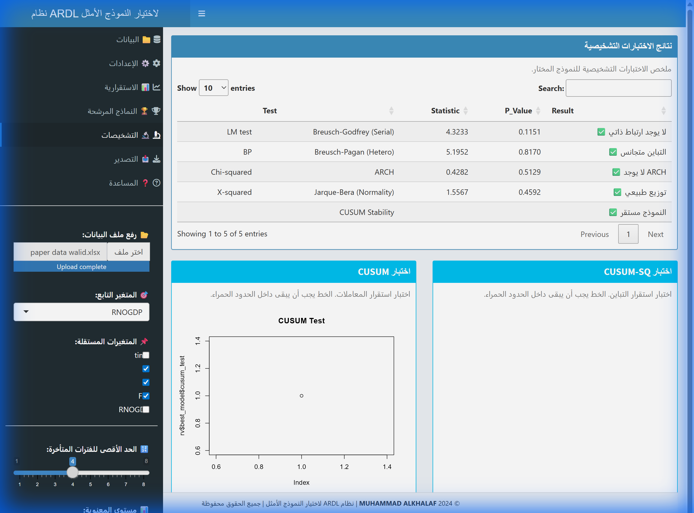

# نظام ARDL لاختيار النموذج الأمثل

# ARDL Optimal Model Selection System

© 2025 MUHAMMAD ALKHALAF - جميع الحقوق محفوظة

---

## 🌐 جرب التطبيق مباشرة

[]([https://muhammedalkhalaf.shinyapps.io/ardl_app/](https://drmuhammad.shinyapps.io/ardl-model-selection/))

**[👉 افتح التطبيق الآن](https://drmuhammad.shinyapps.io/ardl-model-selection/)**

---

## 🎬 عرض توضيحي


## 📸 لقطات الشاشة

### الواجهة الرئيسية



### نتائج التحليل



### التشخيصات



---

## نظرة عامة

تطبيق R Shiny لاختيار أفضل نموذج ARDL تلقائياً بناءً على نظام نقاط متعدد المعايير.

## المميزات

- 📊 واجهة عربية كاملة مع نصوص شرح تفاعلية
- 🔬 اختبارات الاستقرارية (ADF, PP, KPSS)
- 🏆 نظام نقاط ذكي لتقييم النماذج
- ✅ اختبارات تشخيصية شاملة
- 📈 شريط تقدم أثناء التحليل
- ❓ صفحة مساعدة مدمجة
- 📥 تصدير متعدد الصيغ (Excel, Word, CSV, R)

## التثبيت

### المتطلبات

```r
install.packages(c(
  "shiny", "shinydashboard", "shinyWidgets", "shinyBS", "DT",
  "ARDL", "urca", "strucchange", "lmtest", "sandwich",
  "ggplot2", "plotly", "dplyr", "tidyr", "readxl", 
  "writexl", "officer", "flextable"
))
```

### التشغيل المحلي

```r
# استنساخ المستودع
git clone https://github.com/YOUR_USERNAME/ardl-model-selection.git
cd ardl-model-selection

# تشغيل التطبيق
shiny::runApp()
```

## نظام النقاط

| المعيار | الوزن | الوصف |
|---------|-------|-------|
| 🔴 الارتباط الذاتي | 30 | خلو البواقي من الارتباط الذاتي |
| 🟢 ECT | 25 | معامل تصحيح الخطأ سالب ومعنوي |
| 🟡 التباين | 15 | تجانس تباين البواقي |
| 🔵 CUSUM | 10 | استقرار معاملات النموذج |
| ⚪ التوزيع | 5 | التوزيع الطبيعي للبواقي |
| 🟣 المعنوية | 15 | نسبة المتغيرات المعنوية |

## الاستخدام

1. **رفع البيانات**: Excel (.xlsx) أو CSV
2. **اختيار المتغيرات**: التابع والمستقلة
3. **ضبط الإعدادات**: الفترات المتأخرة ومستوى المعنوية
4. **تشغيل التحليل**: اضغط 🚀 وانتظر
5. **مراجعة النتائج**: تصفح التبويبات
6. **التصدير**: اختر الصيغة المناسبة

## هيكل المشروع

```
ardl_app/
├── app.R                     # التطبيق الرئيسي
├── R/
│   ├── scoring_system.R      # نظام النقاط
│   ├── diagnostic_tests.R    # الاختبارات التشخيصية
│   ├── stationarity_tests.R  # اختبارات الاستقرارية
│   └── export_functions.R    # التصدير
├── www/
│   └── custom.css            # التنسيق
├── screenshots/              # لقطات الشاشة
├── demo.webp                 # عرض توضيحي
└── README.md                 # التوثيق
```

## المؤلف

**MUHAMMAD ALKHALAF**

## الترخيص

© 2025 MUHAMMAD ALKHALAF - جميع الحقوق محفوظة

هذا البرنامج محمي بموجب حقوق النشر. لا يجوز نسخه أو توزيعه أو تعديله دون إذن كتابي من المؤلف.
